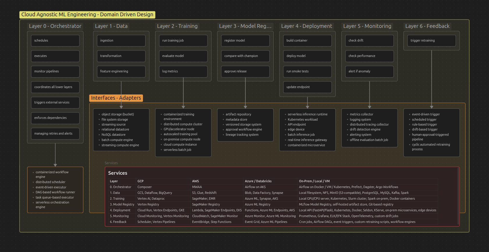

# `usp-airflow-project`

## USP-ESALQ

The following branch link contains the codebase developed as part of a research project at USP-ESALQ exploring the design and evaluation of **parallelized ETL (Extract, Transform, Load) pipelines** using Apache Airflow. It investigates how Airflow DAGs can be structured to support modularity, scalability, and high throughput in workflows, especially in environments with heavy computational demands. Link to the research codebase:

USP-ESALQ TCC codebase branch: [tcc-original-code-reference](https://github.com/offcomputer/usp-airflow-project/tree/tcc-original-code-reference)

---

## Follow‑On MLOps Research `main` branch

The follow‑on research on the `main` branch extends the original ETL focus into a fully instrumented, cloud‑agnostic MLOps sandbox. The `docker-stack-compose.yml` file stitches together per‑service compose files under a single `core` network with shared volumes (`shared_data`, `airflow_logs`, `postgres_data`, `minio_data`, etc.) so you can spin up everything with one command. In production, design this network as a segregated, security-hardened segment. Key pieces:

- **Airflow Celery cluster** (`docker/airflow/`): custom image with S3 provider, MLflow, Qdrant client, pytest baked in; services for web/API, scheduler, workers, triggerer, DAG processor, and Flower. Prewired connections to Postgres, Redis, MinIO (S3), MLflow, and Qdrant. Mounts project `src`, DAGs, config, plugins, logs.
- **State layer**: Postgres with tunable buffers/init scripts (`docker/postgres/`), two Redis instances (one for Airflow broker/result, one for app caching) with separate configs (`docker/redis/`).
- **Object storage**: MinIO server plus init job that creates buckets for Airflow logs/XComs and MLflow artifacts (`docker/minio/`).
- **Experiment tracking**: MLflow server backed by Postgres and MinIO artifacts (`docker/mlflow/`).
- **Vector DB**: Qdrant exposed on 6333/6334 with persisted storage (`docker/qdrant/`).
- **GPU notebook**: RAPIDS Jupyter Lab with CUDA 12.9 and pinned PyTorch wheels, mounting `src` and `tmp` for interactive ML work (`docker/rapids/`).
- **Observability**: Prometheus + StatsD gateway, Grafana + Loki + Promtail scraping Airflow logs, and exporters for Postgres and both Redis instances (`docker/prometheus/`, `docker/grafana/`, `docker/exporters/`).

Primary ports: Airflow 8080/5555, MinIO 9000/9001, MLflow 5000, Grafana 3000, Prometheus 9090, Loki 3100, Qdrant 6333/6334, RAPIDS/Jupyter 8888. Adjust via env vars in the compose files. Launching the stack brings up a reproducible, local MLOps environment suitable for benchmarking cloud‑agnostic data/ML pipelines.

ATTENTION: Secrets (passwords, tokens, keys) are intentionally exposed here for development only. For any test or production deployment, move them out of the compose files and into a secure store such as Vault, environment files mounted via Docker/Kubernetes secrets, or your platform’s native secret manager.
